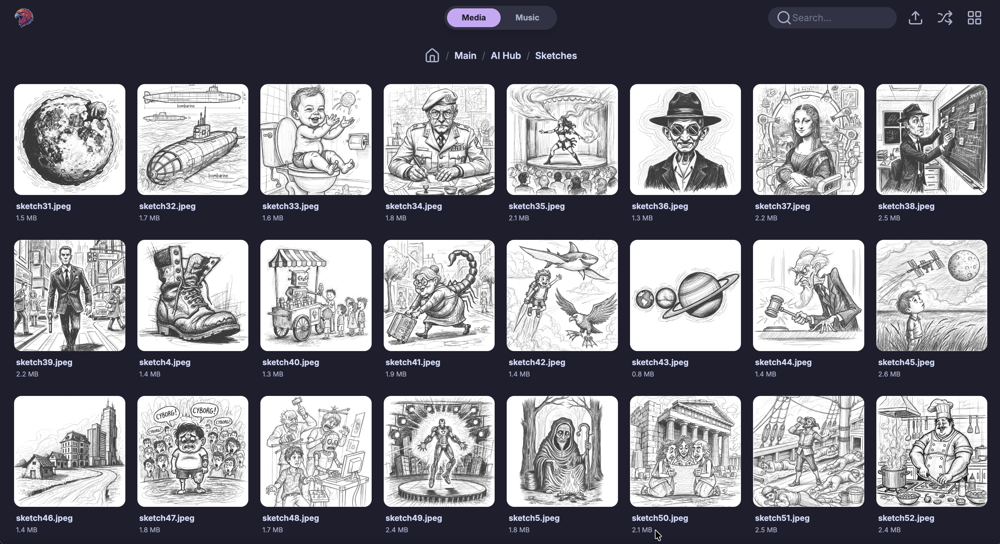
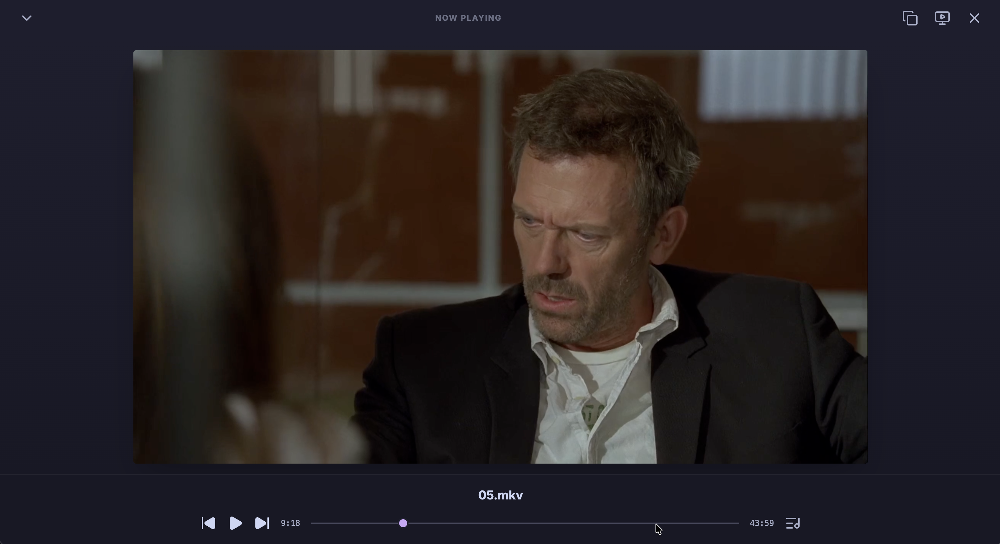
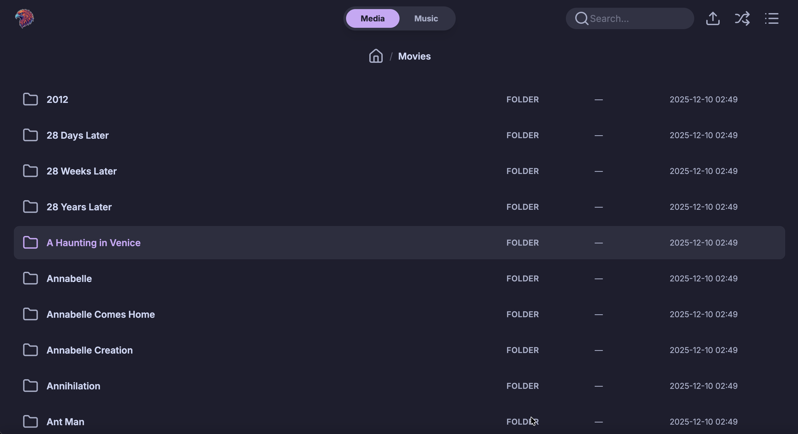
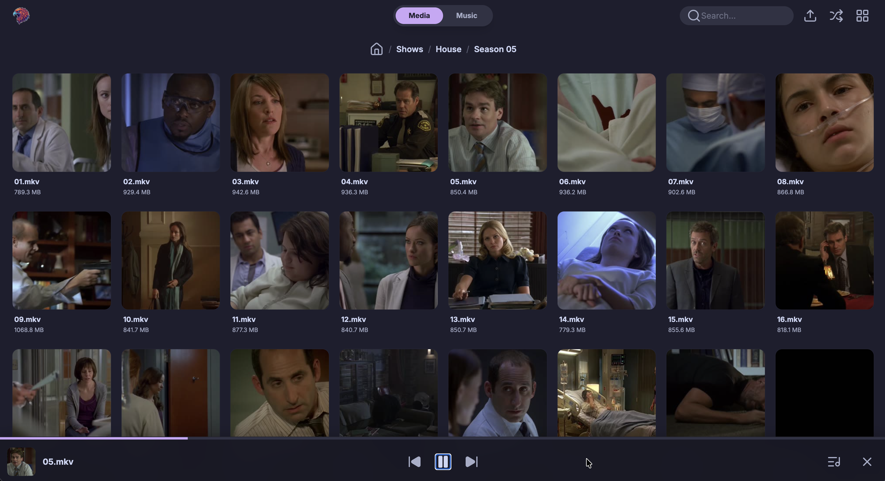
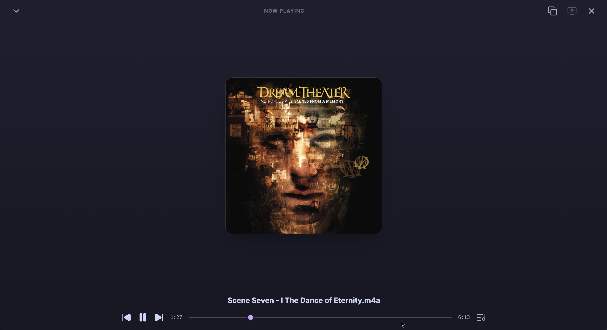
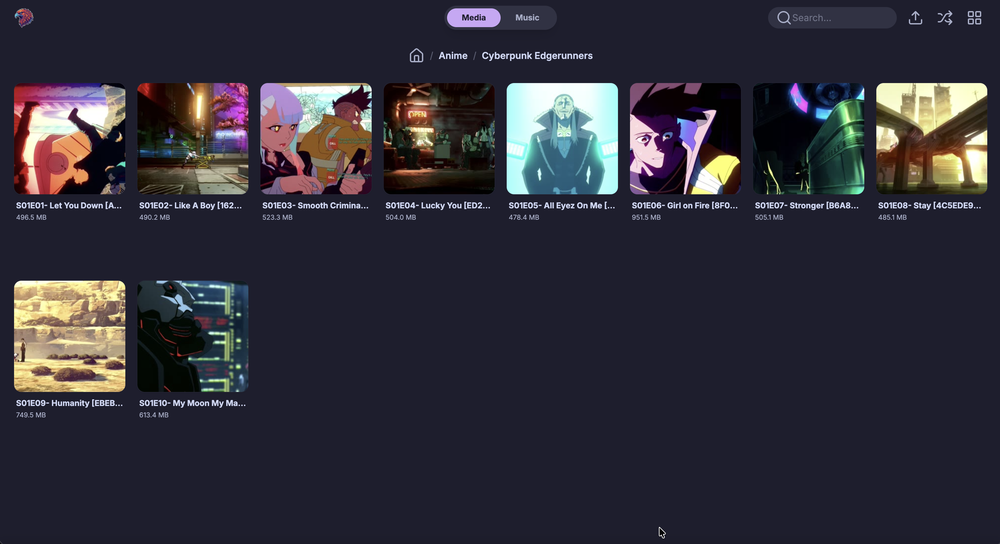

<div align="center">
  
  <h1>Raikiri</h1>

  <a href="https://github.com/tanq16/raikiri/actions/workflows/release.yml"></a>&nbsp;<a href="https://github.com/Tanq16/raikiri/releases"></a>&nbsp;<a href="https://hub.docker.com/r/tanq16/raikiri"></a><br><br>
</div>

A fast, simple, self-hosted, no-nonsense media server. Lightweight alternative to Jellyfin/Plex without complex metadata tagging.

The aim is to provide an elegant directory listing for images, videos, and audio. It uses folder navigation and predictable thumbail paths for cover art, thumbnails, etc. Other files are also available to browse and can be directly downloaded.

## Features

- Beautiful Catppuccin Mocha themed application for modern web-based directory listing
- Dual system with separate Media and Music modes, each with independent directory paths
- Music navigation is folder-first (Artist → Album → Tracks) with no extra pills
- Tracks in Music are always shown in list view without thumbnails
- Intelligent thumbnail system that displays previews when available, else fallback to icons
- Playlist queue automatically created from media (removable items) in current directory
- Player bar with expanded player view supporting audio, video, and image playback
- Image slideshow mode with automatic advancement every 5 seconds
- Shuffle mode for recursive directory playback (media files only)
- Queue dialog showing current playlist with ability to jump to any item
- Fullscreen player support for videos and images
- Subtitle support for videos with automatic detection of SRT files and embedded tracks
- Player with support to switch between multiple available subtitle tracks
- Search functionality to filter files in the current directory
- Ability to upload files to the server at specific paths
- Thumbnail generation mode in CLI for movies, shows, and videos (using `ffmpeg` and TMDB API)
- Automatic cache cleanup that removes old HLS session files older than 3 days
- Fully self-hosted with local assets and self-contained binary and container
- Efficient size for both binary and container, ~15 and ~50 MB resp

## Screenshots

<div align="center">

| | | |
|:---:|:---:|:---:|
|  |  |  |
|  |  |  |
|  |  |  |

</div>

## Usage

### Docker (for Homelab)

```bash
mkdir $HOME/raikiri # you don't need to create this if you already have media in a specific directory
```
```bash
docker run --rm -d --name raikiri \
  -p 8080:8080 \
  -v $HOME/raikiri:/app/media \
  -v $HOME/music:/app/music \
  -v $HOME/raikiri-cache:/app/cache \
  tanq16/raikiri:main
```

Available at `http://localhost:8080`. Docker Compose example:

```yaml
services:
  raikiri:
    image: tanq16/raikiri:main
    container_name: raikiri
    volumes:
      - /home/tanq/raikiri:/app/media # Change as needed
      - /home/tanq/music:/app/music # Change as needed
      - /home/tanq/raikiri-cache:/app/cache # HLS segment cache
    ports:
      - 8080:8080
```

### Binary

To use the binary, simply download the latest version from the project releases and run as follows:

```bash
raikiri -media $YOUR_MEDIA_FOLDER -music $YOUR_MUSIC_FOLDER -cache $YOUR_HLD_CACHE_FOLDER
```

Flags:
- `-media`: media directory path
- `-music`: music directory path
- `-cache`: HLS cache directory

Switch between Media and Music modes via interface tabs. Think of it as your own minimal Netflix on the Media tab and your own minimal Spotify on the Music tab.

Cache directory stores temporary HLS segments generated during video playback. Auto-cleanup runs daily at 3 AM, removing sessions older than 3 days.

Storing cache in your SSD will yield faster performance (or instant seeks anywhere in the video). However, using HDD is recommended for longevity (lots of segment writes), even though it's not instant when seeking to further ahead right after launching the video.

### Local Development

Install with Go 1.24+:

```bash
go install github.com/tanq16/raikiri@latest
```

Or build from source:

```bash
git clone https://github.com/tanq16/raikiri.git && \
cd raikiri && \
go build .
```

### Additional Notes

#### Requirements

Requires `ffmpeg` (includes `ffprobe`) in PATH for:
- Video playback (HLS transmuxing; transcodes if audio is a mismatch)
- Thumbnail generation (`-prepare` flag)

For Docker deployments, provided image includes `ffmpeg`.

#### Thumbnails

Thumbnails are stored as hidden files (`.filename.thumbnail.jpg`) alongside media. It is displayed in grid view when available.

To generate thumbnails, use the `-prepare` flag with one of the following modes:
- `videos`: Generate thumbnails recursively for all video files in the current directory
- `video`: Generate thumbnails for video files in the current folder only
- `shows`: Auto-match TV shows using TMDB API (requires `TMDB_API_KEY` environment variable)
- `show`: Manual interactive TV show matching using TMDB API (requires `TMDB_API_KEY` environment variable)
- `movies`: Auto-match movies using TMDB API (requires `TMDB_API_KEY` environment variable)
- `movie`: Manual interactive movie matching using TMDB API (requires `TMDB_API_KEY` environment variable)

```bash
raikiri -prepare videos
```

> [!NOTE]
> - Video thumbnails are screenshots at 50% of the video duration
> - For images, the original file is used as a fallback if no thumbnail exists

> [!TIP]
> In Music mode, album art is considered as the directory thumbnail (`.thumbnail.jpg`), artist cover is considered from artist directory thumbnail. Tracks use list view (no thumbnails).

#### Player and Playlists

Clicking media auto-creates a playlist from current directory files. Player bar shows current item with controls. Click to expand for seek controls, time display, and queue dialog.

Queue dialog highlights active item; click any item to jump. Shuffle button plays all media recursively in random order (skips non-media).

- Images: auto-advance every 5s
- Videos/audio: play/pause, prev/next, seek
- Fullscreen: videos and images only

**Video Playback**
- HLS auto-segmented to 6s segments via `ffmpeg`
- Audio is played back directly in HTML5
- Unplayable files open in new tab as raw GET

**Subtitles**
- Auto-detection of SRTs in same directory, `subs/`, or `Subs/`
- Auto-extraction of embedded subtitle tracks
- All subtitles are converted to WebVTT and served as options
- CC button allows selecting across available tracks or disabled

#### Quickie on Playback Sync

- Videos are HLS tranmuxed/transcoding via `ffmpeg` (full seekability, format compatibility)
- Fullscreen player with custom overlay with controls (play/pause, +-10s seek, seek bar, exit)
- Fullscreen disabled for audio (images/videos only)
