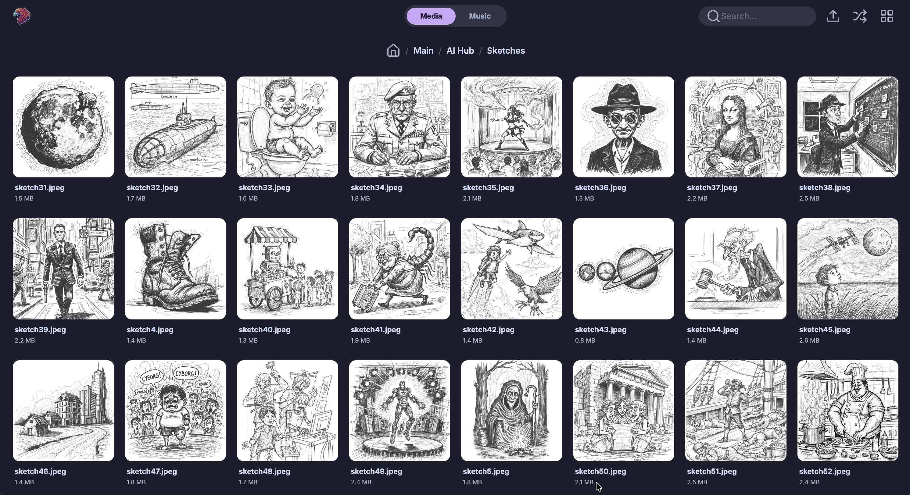
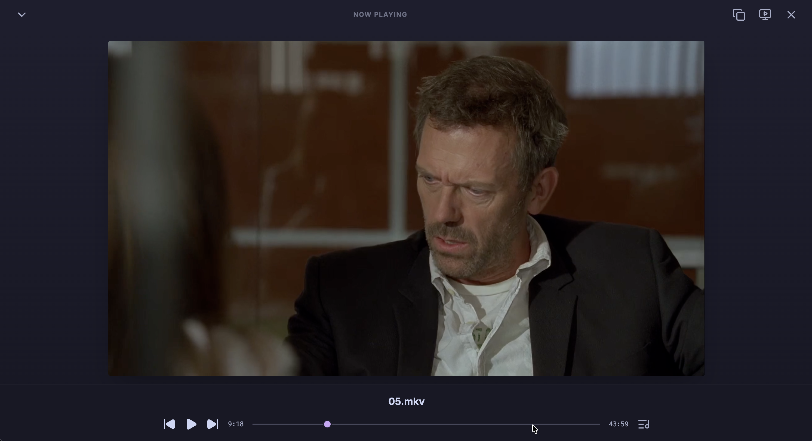
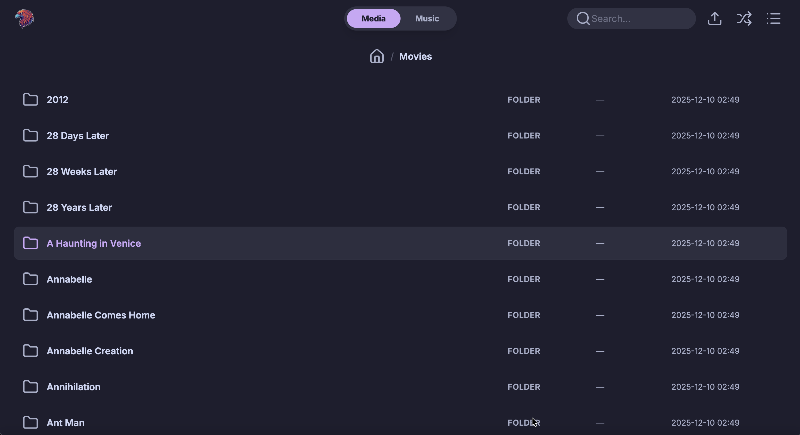
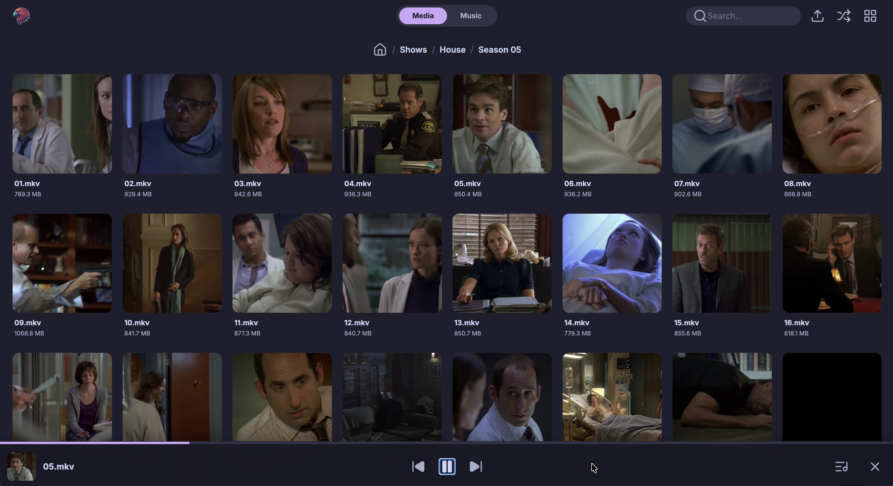
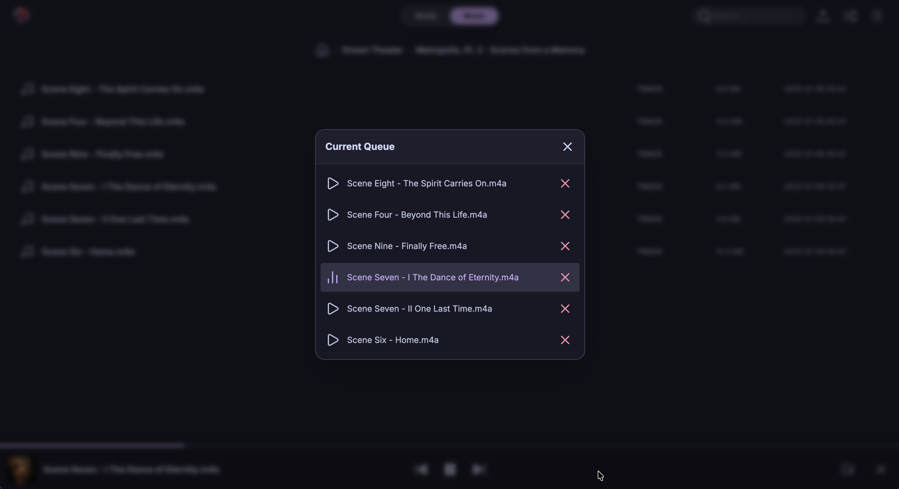
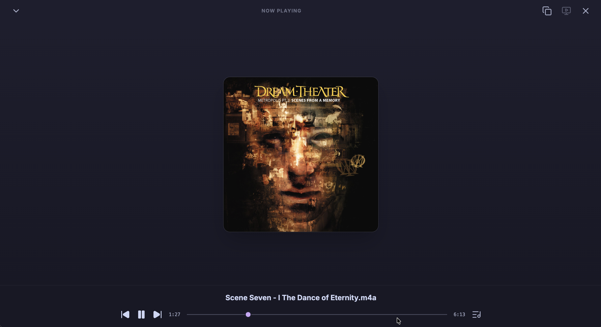
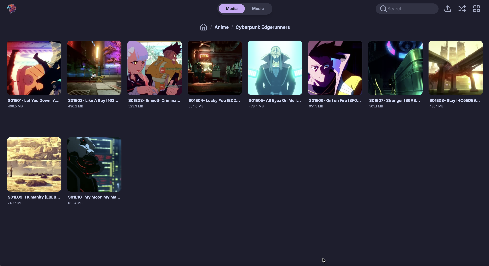

<div align="center">
  
  <h1>Raikiri</h1>

  <a href="https://github.com/tanq16/raikiri/actions/workflows/release.yaml"></a>&nbsp;<a href="https://github.com/Tanq16/raikiri/releases"></a>&nbsp;<a href="https://hub.docker.com/r/tanq16/raikiri"></a><br><br>

  <a href="#features">Features</a> &bull; <a href="#screenshots">Screenshots</a> &bull; <a href="#usage">Usage</a> &bull; <a href="#playback">Playback</a> &bull; <a href="#tools">Tools</a> &bull; <a href="#android-app">Android</a>
</div>

A fast, simple, self-hosted, no-nonsense media server. Lightweight alternative to Jellyfin/Plex without complex metadata tagging.

The aim is to provide an elegant directory listing for images, videos, and audio. It uses folder navigation and predictable thumbnail paths for cover art, thumbnails, etc. Other files are also available to browse and can be directly downloaded.

## Features

- Beautiful Catppuccin Mocha themed application for modern web-based directory listing
- Dual system with separate Media and Music modes, each with independent directory paths
- Music navigation is folder-first (Artist → Album → Tracks) with no extra pills
- Tracks in Music are always shown in list view without thumbnails
- Intelligent thumbnail system that displays previews when available, else fallback to icons
- Playlist queue automatically created from media (removable items) in current directory
- Player bar with expanded player view supporting audio, video, and image playback
- Image slideshow mode with automatic advancement every 5 seconds
- Shuffle mode for recursive directory playback (media files only)
- Queue dialog showing current playlist with ability to reorder items and jump to any item
- Video history tracking - stores last 50 video paths in browser local storage
- Fullscreen player support for videos and images (toggle with the `F` key in expanded view)
- Subtitle support for videos with automatic detection of SRT/ASS/SSA/VTT files and embedded tracks
- Player with support to switch between multiple available subtitle tracks
- Player with support to switch between multiple available audio tracks (e.g. original vs. dubbed)
- Hierarchical search that recursively filters the current directory and all subfolders, with results playable directly
- Ability to upload files to the server at specific paths
- Thumbnail generation mode in CLI for movies, shows, and videos (using `ffmpeg` and TMDB API)
- Automatic cache cleanup that removes old HLS session files older than 3 days
- Fully self-hosted with local assets and self-contained binary and container
- Efficient size for both binary and container, ~15 and ~50 MB resp
- Companion Android app for music with background playback and media notification support

## Screenshots

<div align="center">

| | | |
|:---:|:---:|:---:|
|  |  |  |
|  |  |  |
|  |  |  |

</div>

## Usage

Switch between Media and Music modes via interface tabs. Think of it as your own minimal Netflix on the Media tab and your own minimal Spotify on the Music tab.

### Docker (for Homelab)

```bash
mkdir $HOME/raikiri # you don't need to create this if you already have media in a specific directory
```
```bash
docker run --rm -d --name raikiri \
  -p 8080:8080 \
  -v $HOME/raikiri:/app/media \
  -v $HOME/music:/app/music \
  -v $HOME/raikiri-cache:/app/cache \
  tanq16/raikiri:latest
```

Available at `http://localhost:8080`. Docker Compose example:

```yaml
services:
  raikiri:
    image: tanq16/raikiri:latest
    container_name: raikiri
    volumes:
      - /home/tanq/raikiri:/app/media # Change as needed
      - /home/tanq/music:/app/music # Change as needed
      - /home/tanq/raikiri-cache:/app/cache # HLS segment cache
    ports:
      - 8080:8080
```

### Binary

Download the latest version from the project releases and run as follows:

```bash
raikiri serve --media $YOUR_MEDIA_FOLDER --music $YOUR_MUSIC_FOLDER --cache $YOUR_HLS_CACHE_FOLDER
```

Flags:
- `--media`: media directory path (default: `.`)
- `--music`: music directory path (default: `./music`)
- `--cache`: HLS cache directory (default: `/tmp`)
- `--port`: port to listen on (default: `8080`)
- `--version`: print version information

### Local Development

Install with Go 1.25+:

```bash
go install github.com/tanq16/raikiri@latest
```

Or build from source:

```bash
git clone https://github.com/tanq16/raikiri.git && \
cd raikiri && \
make build
```

### Requirements

Requires `ffmpeg` (includes `ffprobe`) in PATH for video playback (HLS transmuxing; transcodes if audio is a mismatch) and thumbnail generation (`prepare` subcommand). The provided Docker image already includes `ffmpeg`.

If `ffmpeg`/`ffprobe` are missing, the server still starts and logs a startup warning; video playback then returns a clear error instead of failing silently (image and audio browsing continue to work).

### Cache

The cache directory stores temporary HLS segments generated during video playback. Auto-cleanup runs daily at 3 AM, removing sessions older than 3 days.

Storing cache on an SSD yields faster performance (or instant seeks anywhere in the video). However, an HDD is recommended for longevity (lots of segment writes), even though it's not instant when seeking far ahead right after launching the video.

## Playback

Clicking media auto-creates a playlist from the current directory's files. The player bar shows the current item with controls; click to expand it for seek controls, time display, and the queue dialog.

### Queue

The queue dialog highlights the active item; click any item to jump, or use the up/down buttons to reorder the queue. The shuffle button plays all media recursively in random order (skips non-media).

- Images: auto-advance every 5s
- Videos/audio: play/pause, prev/next, seek
- Fullscreen: videos and images only

### History

- Click the Raikiri logo to open a history modal with the last 50 videos (not audio/images) played
- History is stored in browser localStorage and shows the full file path, most recent first

### Video Playback

- Compatible MP4s (H.264/HEVC + AAC 48kHz stereo) are served directly via HTTP range requests for instant playback
- All other videos are HLS-segmented to 6s fMP4 segments via `ffmpeg`, with audio transcoded to 48kHz AAC to prevent A/V drift (full seekability and format compatibility)
- Audio plays directly in HTML5; unplayable files open in a new tab as a raw GET
- Fullscreen uses a custom overlay (play/pause, ±10s seek, seek bar, exit); press `F` to toggle from the expanded view (videos and images only)

### Subtitles

- Auto-detection of SRT/ASS/SSA/VTT subtitles in the same directory, `subs/`, or `Subs/`
- Auto-extraction of embedded subtitle tracks
- All subtitles are converted to WebVTT and served as options
- CC button allows selecting across available tracks or disabling them

### Audio Tracks

- For videos with multiple audio streams, an audio button lists the available tracks
- Selecting a track re-streams from the current position; direct playback switches to remux so the chosen track can be applied

## Tools

Standalone CLI subcommands for preparing thumbnails and inspecting or re-encoding video files.

### Thumbnails

Thumbnails are stored as hidden files (`.filename.thumbnail.jpg`) alongside media and displayed in grid view when available. Generate them with the `prepare` subcommand:

- `thumbnails`: Generate ffmpeg thumbnails recursively for all videos in the current directory
- `thumbnails --current`: Generate thumbnails for the current directory only (non-recursive)
- `thumbnails --force`: Overwrite existing thumbnails (by default, files that already have one are skipped)
- `thumbnails <file>`: Generate a thumbnail for a single video file
- `shows`: Auto-match TV shows using TMDB API (requires `TMDB_API_KEY` environment variable); run in the directory containing all show directories
- `shows --manual`: Interactive TV show matching for a single show directory
- `movies`: Auto-match movies using TMDB API (requires `TMDB_API_KEY` environment variable); run in the directory containing all movie directories
- `movies --manual`: Interactive movie matching for a single movie directory

```bash
raikiri prepare thumbnails
raikiri prepare thumbnails --current
raikiri prepare thumbnails --force
raikiri prepare thumbnails path/to/video.mkv
raikiri prepare shows
raikiri prepare movies --manual
```

> [!NOTE]
> - Video thumbnails are screenshots at 50% of the video duration
> - For images, the original file is used as a fallback if no thumbnail exists

> [!TIP]
> In Music mode, album art is used as the directory thumbnail (`.thumbnail.jpg`) and artist cover from the artist directory thumbnail. Tracks use list view (no thumbnails).

### Video Tools

The `video-info` and `video-encode` commands inspect and re-encode video files.

```bash
raikiri video-info path/to/video.mkv
raikiri video-encode path/to/video.mkv
raikiri video-encode --quality high path/to/video.mkv
raikiri video-encode --slower path/to/video.mkv
```

`video-info` displays a table with container info, video/audio/subtitle streams, codecs, resolution, frame rate, bitrate, and languages.

`video-encode` smart-encodes to H.265 with automatic stream selection:
- Selects the best audio stream (rejects commentary/descriptive tracks)
- Keeps all subtitle streams, picks MP4 or MKV container based on subtitle type
- Auto-halves high frame rates to their standard lower counterpart (60→30, 59.94→29.97, 50→25, 48→24)
- Quality tiers via `--quality`: `very-high`, `high`, `medium` (default), `low`
- Default preset is `medium`; use `--slower` for preset `slow` (better compression, longer encode)
- Output file is auto-named as `<basename>.h265.<mp4|mkv>`

## Android App

Raikiri includes a companion Android app for music playback. It is **not** a standalone music player — it connects to a self-hosted Raikiri server and streams from it. The app exists because Chrome Android restricts background audio auto-advance (changing tracks kills audio output when the screen is off). The native app uses Media3 ExoPlayer with a foreground service, so background playback and track advancement work reliably.

**What it does:**
- Browse artists and albums (folder navigation, same as the web app)
- View all songs with search/filter
- Background playback with Android media notification and lock screen controls
- Queue management with track removal
- Grid and list view toggle for artists/albums
- Catppuccin Mocha dark theme matching the web app

**Install:**
- Download the APK from the [latest release](https://github.com/Tanq16/raikiri/releases/latest)
- For auto-updates via [Obtainium](https://github.com/ImranR98/Obtainium), add `https://github.com/Tanq16/raikiri` as a source and configure it to track the `app-release.apk` asset

On first launch, go to Settings and enter your Raikiri server URL (e.g., `http://192.168.1.100:8080`).
