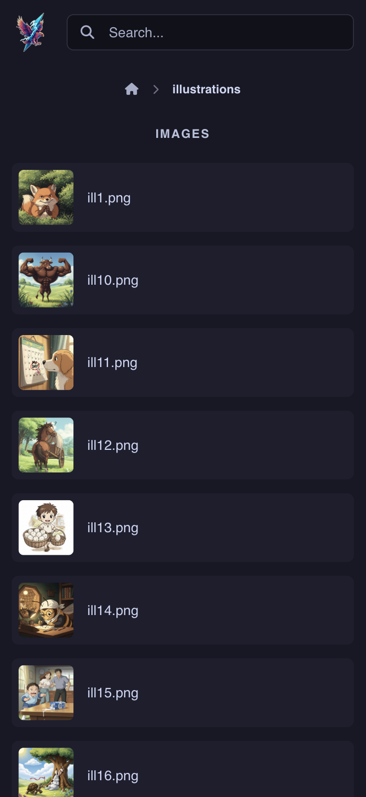

<div align="center">
  
  <h1>Raikiri</h1>

  <a href="https://github.com/tanq16/raikiri/actions/workflows/release.yml"></a>&nbsp;<a href="https://github.com/Tanq16/raikiri/releases"></a>&nbsp;<a href="https://hub.docker.com/r/tanq16/raikiri"></a><br><br>
</div>

A fast, simple, self-hosted, no-nonsense app for running a media server. This is meant for those instances when you don't need something beefy like Jellyfin or Plex, and don't want to go through the pain of metadata tagging.

The aim of the application is to provide directory listing in an elegant interface to view images and videos easily. There is no need for metadata and match, Raikiri just uses the folder navigation to display things. While Raikiri only displays common image and video formats, other files will also be displayed to download directly. Additionally, Markdown files are rendered as HTML along with mermaid diagrams.

## Features

- Beautiful Catppuccin Mocha themed application for modern web-based directory listing
- Uses Plyr.js to play media files, and also showcases image files
- Raw download option for all file types
- GitHub-flavored (but styled in Catppuccin) rendering of markdown files (including mermaid support)
- Functionality in the binary to prepare media for thumbnails
- Fully self-hosted with local assets and self-contained binary and container
- Efficient sizefor both binary and container - under 14 MB

## Screenshots

| Desktop View | Mobile View |
| --- | --- |
|  |  |
|  |  |

## Usage

### Docker (for Homelab)

```bash
mkdir $HOME/raikiri # you don't need to create this if you already have media in a specific directory
```
```bash
docker run --rm -d --name raikiri \
  -p 8080:8080 \
  -v $HOME/raikiri:/app/media \
  tanq16/raikiri:main
```

The application will be available at `http://localhost:8080` (or your server IP). You can also use the following compose file:

```yaml
services:
  raikiri:
    image: tanq16/raikiri:main
    container_name: raikiri
    volumes:
      - /home/tanq/raikiri:/app/media # Change as needed
    ports:
      - 8080:8080
```

### Binary

To use the binary, simply download the latest version from the project releases and run as follows:

```bash
raikiri -media $YOUR_MEDIA_FOLDER
```

Additionally, you can use also use the optional parameters of `-port` to specify a port of your choice, and `-refresh` to specify number of minutes in which to refresh the list of files.

### Local development

With `Go 1.23+` installed, run the following to download the binary to your GOBIN:

```bash
go install github.com/tanq16/raikiri@latest
```

Or, you can build from source like so:

```bash
git clone https://github.com/tanq16/raikiri.git && \
cd raikiri && \
go build .
```

### Additional Notes

Ideally, you can just run the service and it will be fine. But you may want to see thumbnails of media (preview-scaled images and a frame from video files).

Raikiri provides a way to generate thumbnails for video and image files using `ffmpeg`. You can manually run this per directory or on your entire directory to create thumbnails for the media. The commands are:

```bash
raikiri -prepare -media $YOUR_MEDIA_FOLDER
```

Raikiri will intelligently select thumbnails and display as needed. To prepare thumbnails, Raikiri will intelligently skip file which already have a thumbnail. To force re-creation of thumbails use the following:

```bash
raikiri -prepare -media $YOUR_MEDIA_FOLDER -force
```

> [!NOTE]
> Raikiri takes the image at 40 seconds for a video to create a thumbnail. This is heuristically selected.

Raikiri piggy-backs off of the browser-provided video playback (HTML5 video). This means that certain media types like `.mkv` will not be playable directly on some browsers. However, all media where playback is not supported, will open in a new tab with a raw GET request.
